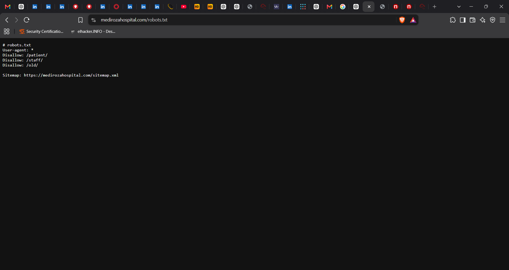

# Penetration Testing Report — Mediroza General Hospital

**Prepared for:** Mediroza General Hospital
**Prepared by:** [Your Name], Networkwalks Batch B082 — Week 4
**Engagement Type:** Black-box Penetration Test
**Target:** https://medirozahospital.com
**Duration:** 3 Days
**Report Date:** [Insert Date]

**Authorization:** Written permission granted by the client for this controlled, educational security assessment. All testing was limited to the agreed scope (target domain only, no social engineering, no denial-of-service testing).

---

## 1. Executive Summary

During this black-box penetration test of `medirozahospital.com`, multiple critical vulnerabilities were identified and successfully exploited, resulting in full compromise of patient confidentiality and exposure of sensitive internal hospital data. The engagement progressed through reconnaissance, authentication bypass, unauthorized data access, and cracking of encrypted patient files.

Key findings include:

- An unrestricted `robots.txt` file that disclosed sensitive, non-public directory paths (`/patient/`, `/staff/`, `/old/`).
- A publicly accessible database backup file (`mediroza_db_backup_2019.sql`) hosted under `/old/`, exposing full staff records including names, national ID numbers, salaries, and contact details.
- A SQL Injection vulnerability in the Patient Portal login form, combined with a username-enumeration flaw (differing error messages for invalid usernames vs. invalid passwords), which allowed full authentication bypass as an administrator.
- Three password-protected/encrypted patient pathology PDF reports stored in the admin dashboard, all of which were successfully decrypted using dictionary/wordlist attacks.
- Sensitive metadata/content within the retrieved database backup exposing hospital shareholder information alongside staff salary data.

**Overall Risk Rating: Critical.** The combination of information disclosure, SQL injection, and weak file encryption resulted in a complete breach of patient data confidentiality (a HIPAA/POPIA-relevant category of data) and exposure of confidential corporate financial and ownership information.

---

## 2. Scope and Methodology

| Item | Detail |
|---|---|
| Target | https://medirozahospital.com |
| Testing Type | Black-box, external, no credentials provided |
| Rules of Engagement | Target domain only; no social engineering; no DoS; no out-of-scope testing |
| Tools Used | Web browser (manual recon), `robots.txt` enumeration, manual SQL injection testing, `networkwalks.com/password-cracker` (online dictionary-attack tool), John the Ripper (`john.lst` wordlist) on Kali Linux |
| Methodology | OWASP-aligned black-box methodology: Reconnaissance → Enumeration → Exploitation → Post-Exploitation/Data Analysis → Reporting |

### Methodology Steps

1. **Reconnaissance** — Enumerated the site's `robots.txt` to identify disallowed/hidden paths.
2. **Directory Discovery** — Investigated the disclosed `/old/` directory and located an exposed SQL database backup.
3. **Credential Harvesting** — Extracted staff records from the backup, including an IT Systems Administrator account (Jameel Malik).
4. **Authentication Testing** — Tested the Patient Portal login form and identified a user-enumeration flaw via inconsistent error responses.
5. **Exploitation (SQL Injection)** — Bypassed authentication using a classic SQLi payload in the username field.
6. **Data Extraction** — Accessed the admin dashboard and retrieved three encrypted patient PDF lab reports.
7. **Attack (Password Cracking)** — Extracted the PDF password hashes and ran dictionary attacks to recover plaintext passwords for all three files.
8. **Data Analysis** — Reviewed recovered contents and the database backup for further sensitive exposures (staff salaries, shareholder data).

---

## 3. Findings and Proof of Exploitation

### Finding 1 — Information Disclosure via `robots.txt`

**Description:** The site's `robots.txt` file explicitly lists sensitive directories that should not be publicly known, effectively acting as a roadmap for an attacker.

```
# robots.txt
User-agent: *
Disallow: /patient/
Disallow: /staff/
Disallow: /old/

Sitemap: https://medirozahospital.com/sitemap.xml
```

**Impact:** While `robots.txt` only *requests* that search engines not crawl these paths, it does not prevent direct browser access, and it directly reveals the existence of sensitive areas (`/old/`, `/staff/`, `/patient/`) to any attacker who checks the file — which is one of the very first steps in reconnaissance.

**Evidence:**



---

### Finding 2 — Publicly Accessible Legacy Database Backup

**Description:** The `/old/` directory (flagged by `robots.txt`) contained a publicly downloadable MySQL database backup file:

`medirozahospital.com/old/mediroza_db_backup_2019.sql`

This backup exposed the full `staff` table, including 30 employee records with full names, job titles, departments, email addresses, phone numbers, **national ID numbers**, and **monthly salaries**, as well as a `shareholders` table.

**Sample extracted staff record:**

| ID | Name | Job Title | Department | Email | National ID | Monthly Salary (ZAR) |
|---|---|---|---|---|---|---|
| 9 | Jameel Malik | IT Systems Administrator | IT | j.malik@medirozahospital.com | 85109309908... | 58,000 |
| 3 | Dr. Johan van der Merwe | Medical Director | Management | j.merwe@medirozahospital.com | 85041033033083 | 160,000 |
| 2 | Sarah Botha | Chief Financial Officer | Finance | s.botha@medirozahospital.com | 85031023022082 | 152,000 |

**Impact:** Critical. This is a full-blown data breach of employee PII (national ID numbers are highly sensitive in South Africa under POPIA) and confidential salary data. It also provided intelligence (staff names/roles, e.g. the IT Administrator "Jameel Malik") useful for further social-engineering or credential-guessing attacks (though social engineering itself was out of scope for this engagement).

**Evidence:**


---

### Finding 3 — Authentication Bypass via SQL Injection (Patient Portal)

**Description:** The Patient Portal login page (`medirozahospital.com/patient/login.php`) exhibited two chained weaknesses:

1. **User enumeration**: the login form returned a distinct error message when a username was valid but the password was wrong, versus when the username itself did not exist — allowing an attacker to confirm the existence of the `admin` account.
2. **SQL Injection**: the username field was not properly sanitized/parameterized. Submitting the payload below in the username field, with any arbitrary password, bypassed authentication entirely:

```
Username: admin" --
Password: anypassword
```

This classic SQLi comment-injection technique caused the backend query to terminate the WHERE clause early, effectively authenticating as the `admin` user without a valid password.

**Impact:** Critical. Full authentication bypass granted administrative access to the Patient Portal backend, exposing all patient data and lab reports stored in the system.

**Evidence:**


---

### Finding 4 — Weak Encryption on Confidential Patient PDF Lab Reports

**Description:** Three confidential patient pathology lab reports were retrieved from the admin dashboard, each protected with PDF password encryption (PDF R3 / 128-bit RC4). The password hashes (`$pdf$...`) were extracted and run through dictionary attacks using the online tool at `networkwalks.com/password-cracker/` (for two files) and John the Ripper with the `john.lst` wordlist on Kali Linux (for the third, more complex password).

| File | Patient | Lab Ref | Password | Cracking Method |
|---|---|---|---|---|
| Report 1 | Sipho Dlamini | LR-2024-1187 | `123456` | Built-in wordlist (online cracker) |
| Report 2 | Priya Reddy | LR-2024-1192 | `password` | Built-in wordlist (online cracker) |
| Report 3 | Emily Thompson | LR-2024-1205 | `!@#$%^&` | John the Ripper, `john.lst` wordlist (Kali Linux) |

**Impact:** Critical. All three files were trivially decrypted, exposing full patient medical records (name, date of birth, referring doctor, and lab results) — highly sensitive protected health information (PHI).

**Evidence:**


---

### Finding 5 — Exposed Patient Data (Content Confirmation)

Following decryption, the full contents of all three pathology reports were confirmed accessible:

**Report 1 — Sipho Dlamini (Lab Ref LR-2024-1187, 2024-11-04)**
Patient ID MG-P-10231, DOB 1984-06-12, referred by Dr. Anita Naicker. Results showed an elevated White Cell Count (11.8 ×10⁹/L, flagged HIGH) with other parameters within normal range.

**Report 2 — Priya Reddy (Lab Ref LR-2024-1192, 2024-11-05)**
Patient ID MG-P-10244, DOB 1991-02-28, referred by Dr. Johan van der Merwe. Lipid panel showed elevated Total Cholesterol, LDL, and Triglycerides (all flagged HIGH).

**Report 3 — Emily Thompson (Lab Ref LR-2024-1205, 2024-11-06)**
Patient ID MG-P-10258, DOB 1978-09-03, referred by Dr. Ahmed Kara. Results showed low Haemoglobin, low Ferritin, and low Vitamin D (all flagged LOW), consistent with anaemia indicators.

**Impact:** Confirms complete exposure of protected health information for three identifiable patients, satisfying Milestone 2 (Data Extraction) of the engagement.

---

### Finding 6 — Critical Data Exposure: Staff Salaries & Shareholder Details

Building on Finding 2, deeper analysis of the exposed `mediroza_db_backup_2019.sql` file confirmed exposure of:

- **Staff salaries** for all 30 employees, ranging from R19,000 (Receptionist) to R160,000 (Medical Director) monthly.
- A `shareholders` table (structure confirmed: `shareholder_name`, `share_percent`, and related fields), exposing the hospital's ownership structure — highly sensitive corporate/financial information not intended for public or even general staff access.

**Impact:** Critical. This satisfies Milestone 3 of the engagement and represents a severe breach of both employee privacy and corporate confidentiality.

---

## 4. Risk Rating Summary

| # | Finding | Risk Rating | Justification |
|---|---|---|---|
| 1 | `robots.txt` discloses sensitive paths | Low–Medium | Reconnaissance aid only; not directly exploitable but enables further attacks |
| 2 | Publicly accessible DB backup (`/old/`) | **Critical** | Direct exposure of PII, national IDs, and salary data with no authentication required |
| 3 | SQL Injection / auth bypass (login) | **Critical** | Full admin authentication bypass; root cause enabling further data breach |
| 4 | Weak/crackable PDF encryption | High | Passwords were weak/dictionary-guessable, defeating the confidentiality control |
| 5 | Patient PHI exposure | **Critical** | Direct breach of protected health information for identifiable patients |
| 6 | Staff salary & shareholder exposure | **Critical** | Breach of employee privacy and confidential corporate/financial data |

**Overall Engagement Risk: Critical**

---

## 5. Recommendations and Remediation

1. **Remove sensitive backups from web-accessible directories.** Database backups must never be stored under a publicly reachable web root (e.g. `/old/`). Store backups outside the webroot, encrypted, with strict access controls.
2. **Fix `robots.txt` disclosure risk.** Do not rely on `robots.txt` to hide sensitive paths — it is not an access control. Enforce authentication/authorization at the application/server level for all sensitive directories, and avoid listing sensitive path names in a public file.
3. **Remediate the SQL Injection vulnerability.** Replace dynamic/string-concatenated SQL queries with parameterized queries / prepared statements across all authentication and data-access code. Apply input validation and use a web application firewall (WAF) as defense-in-depth.
4. **Fix the user-enumeration flaw.** Return a single, generic error message ("Invalid username or password") regardless of whether the username or password was incorrect.
5. **Enforce strong password policies for encrypted documents.** Replace user-selected/weak PDF passwords with system-generated strong passwords (minimum 12+ characters, random), or move to a proper access-controlled document delivery system rather than password-protected PDFs.
6. **Implement account lockout / rate limiting.** Add lockout thresholds and CAPTCHA/rate-limiting on the login endpoint to slow brute-force and credential-stuffing attempts.
7. **Principle of least privilege for admin accounts.** Review and restrict the level of access granted to the compromised `admin` account; ensure administrative interfaces are not reachable from the same login surface as patient accounts, and require MFA for all administrative access.
8. **Data minimization and encryption at rest.** Sensitive fields such as national ID numbers and salaries should be encrypted at rest in the database and tightly access-controlled, independent of web-layer protections.
9. **Regular security testing and monitoring.** Conduct periodic penetration tests and implement logging/alerting for anomalous authentication patterns and large data downloads.

---

## 6. Deliverables Checklist (per engagement milestones)

- [x] **M1 — Initial Access:** Proof of access via SQLi auth bypass; 3 encrypted patient PDF lab reports retrieved.
- [x] **M2 — Data Extraction:** All 3 PDF files successfully decrypted with recovered plaintext content documented above.
- [x] **M3 — Attack (Critical Data Exposure):** Staff salaries and shareholder details identified via the exposed database backup.
- [x] **M4 — Pentest Report:** This document.

---

*This report was produced as part of a controlled, authorized educational penetration testing exercise (Networkwalks Batch B082) with written permission from Mediroza General Hospital. These techniques and findings must never be applied to any system without explicit written authorization from the system owner.*
